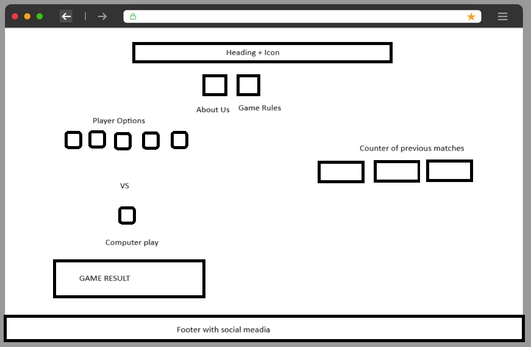
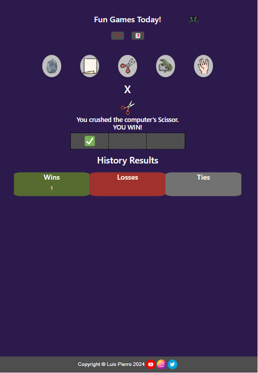
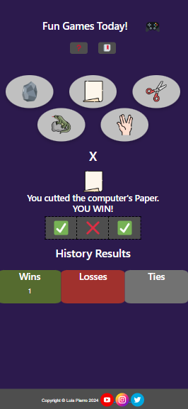
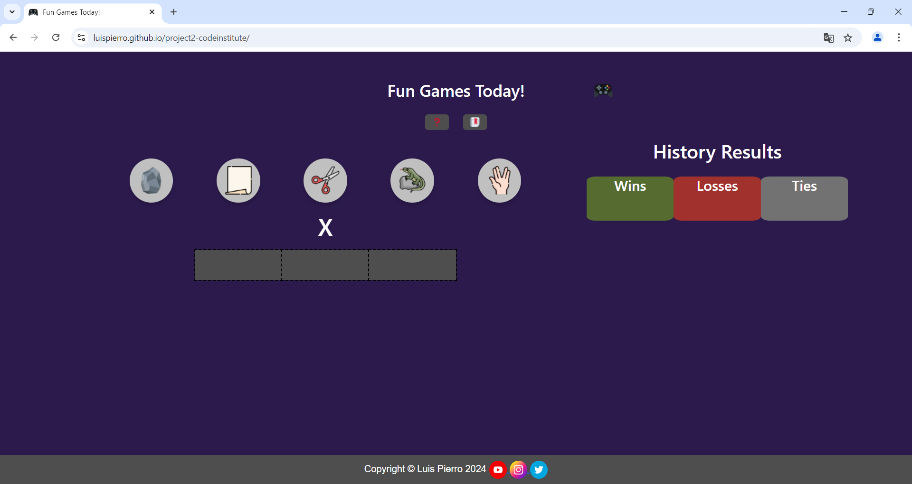
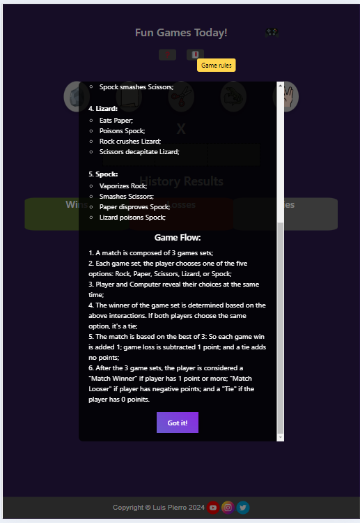
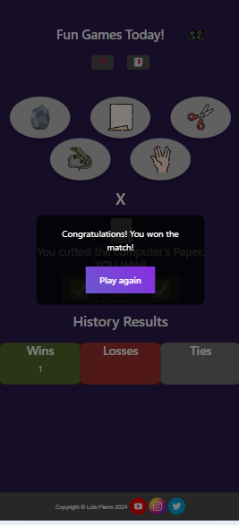
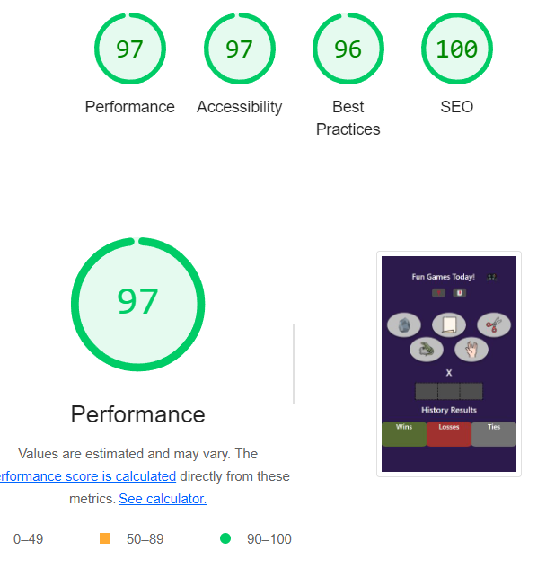

# Fun Games Today

Fun Games Today is a playful and quirky website where players dive into the ultimate showdown of Rock, Paper, Scissors, Lizard, Spock! This isn’t your average game of chance; each match is a best-of-three series, adding a strategic twist to the classic game. Points are earned by winning rounds (+1), lost for defeats (-1), and a tie leaves you just as you were. Rack up the most points across three rounds to claim victory, or risk watching your score slip away. With each click, Fun Games Today delivers fast, addictive fun for casual players and serious strategists alike!

## Design

### Wireframes

Desktop

<description></description>

### Screens

Our Website on Tablets

Our Website on Mobiles

Our Website on Desktops

## Features

- __Game play Options__

- Full responsive, the players can choose their play by a easy click/tap on the option. The display is responsive for all devices and has some cool design for a fun time.

- __Game Help__

- This modern overlay provides a clear, concise description of the game rules, designed for easy understanding at a glance. Players can access it anytime during gameplay without disrupting their experience or needing to leave the page. The overlay blends seamlessly with the interface, ensuring that essential information is always just a click away, helping players stay focused and informed as they play.

__Cards Description__

- The website explanes the 2 buttons on top, it also follows the mouse (ONLY AVAILABLE FOR DESKTOPS):

__Game and Match Result__

- With a fun and modern design, the game indicates the match winner. It also displays the option to play again and continue the Fun.
- It also keeps the history of matches results so the players can keep track on their performance.

### Features Left to Implement

- User Login
  - With the new topics of the course, It will be possible to store credential information to make user login possible.
- Store player game information
  - With a bit more time to explore cookies or a database connections, would be possible to store player infos longer than a session.
- Play Online with friends
  - Would requisite a server wich both players could play together.

## Testing

The website was developed and thought for three major screen sizes: Phones -max 599px; Tablet -min 600px; Laptops and Desktops- min 992px.

It was tested using the inspect feature of the chrome browser and my actual phone and tablet.

### Validator Testing 

- JavaScript Linter
  - No errors passing through the validator: [Jshint linter](assets/jshint.png)

- HTML
  - No errors passing through the validator: [W3C validator](https://validator.w3.org/nu/?doc=https%3A%2F%2Fluispierro.github.io%2Fproject2-codeinstitute%2F)

- CSS
  - No erros passing through the validator. [(Jigsaw) validator](https://jigsaw.w3.org/css-validator/validator?uri=https%3A%2F%2Fluispierro.github.io%2Fproject2-codeinstitute%2F&profile=css3svg&usermedium=all&warning=1&vextwarning=&lang=pt-BR)

- Accessibility
  - No erros passing through the validator. Only alarms for device dependencies, especially for the hover events. [(Wave) validator](https://wave.webaim.org/report#/https://luispierro.github.io/project2-codeinstitute/)

- Lighthouse
  - Good score obtained while passing through lighthouse inspection on browser:

  

### Unfixed Bugs

No major bugs left to be fixed.

## Deployment 

- The site was deployed to GitHub pages. The steps to deploy are as follows: 
  - In the GitHub repository, navigate to the Settings tab 
  - From the source section drop-down menu, select the Master Branch
  - Once the master branch has been selected, the page will be automatically refreshed with a detailed ribbon display to indicate the successful deployment. 

The live link can be found here - https://luispierro.github.io/project2-codeinstitute/

## Credits

### Style Libraries

- The functional grids from Bootstrap were used to leverage market trends and improve the website's responsiveness. [BootStrap](https://getbootstrap.com/docs/5.3/layout/grid/)

### Content 

- The text for the about us and game rules were taken Using AI, Gemini and Chat GPT. They have suggested the story of the company of game design and described the game rules and flow.

### Media

- The icons in the footer were taken from [Flat Icon](https://www.flaticon.com/br/icones-gratis/redes-sociais)
- The favicons in the title of the webpage and for the options were taken from [FavIcon.io](https://favicon.io/)